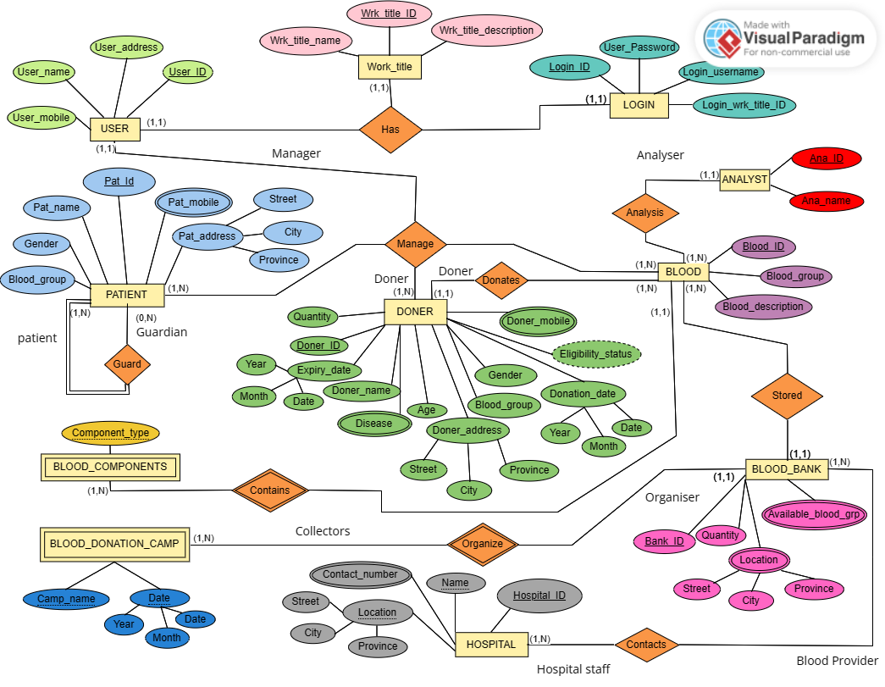
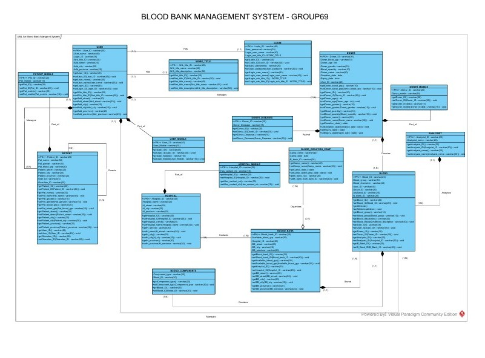

# 🩸 Blood Bank Management System (BBMS)


---

## 📌 Project Overview

The **Blood Bank Management System (BBMS)** is a **MySQL-based relational database system** designed to manage and organize critical data related to blood banks, donors, patients, hospitals, blood inventory, and donation activities.

This database ensures **data consistency, integrity, and efficient retrieval** using **primary keys, foreign keys, constraints, views, and advanced SQL queries**.

---

## 🎯 Objectives

- Maintain structured records of **donors, patients, hospitals, and blood banks**
- Track **blood inventory** and available blood groups in real time
- Manage **blood donation camps** and donor eligibility
- Ensure **data integrity** using relational constraints
- Perform **advanced data analysis** using SQL queries

---

## 🗂️ Database Schema Overview

### 🔐 Authentication & User Management
- `LOGIN` – Stores login credentials
- `WORK_TITLE` – Defines staff roles (Doctor, Nurse, Analyst, etc.)
- `USER1` – User personal details
- `USER_MOBILE` – User contact numbers *(renamed from USER_PHONE)*

### 🧑‍⚕️ Patient & Donor Management
- `PATIENT` – Patient details with guardian relationship
- `PATIENT_MOBILE` – Patient contact numbers
- `DONER` – Donor details including donation and expiry dates
- `DONER_MOBILE` – Donor contact numbers
- `DONER_DISEASE` – Diseases affecting donor eligibility
- `ELIGIBILITY_STATUS` – Derived attribute in `DONER`

### 🏥 Blood Bank & Hospital Management
- `BLOOD_BANK` – Blood bank details and quantity level
- `AVAILABLE_BLOOD_GROUP` – Available blood groups per blood bank
- `HOSPITAL` – Hospital details
- `HOSPITAL_MOBILE` – Hospital contact numbers
- `HOSPITAL_TO_B_BANK` – Many-to-many relationship table

### 🧪 Blood & Analysis Management
- `BLOOD` – Blood sample records
- `BLOOD_COMPONENTS` – Blood components (RBC, WBC, Glucose)
- `ANALYST` – Analysts who test blood samples

### 🏕️ Donation Camp Management
- `BLOOD_DONATION_CAMP` – Blood donation camps organized by blood banks

---

## 📐 Database Design

### 🧩 Entity Relationship (ER) Diagram

<p align="center">
  
</p>

The ER diagram illustrates the conceptual design of the **Blood Bank Management System**, showing entities such as **User, Patient, Donor, Blood, Blood Bank, Hospital, Analyst**, and their relationships.  
It clearly represents **cardinality, attributes, weak entities, derived attributes, and many-to-many relationships**.

---

### 🗂️ Relational Schema / Database Structure

<p align="center">
  
</p>

This diagram represents the **relational database schema** generated from the ER model.  
It shows **tables, primary keys, foreign keys, and relationships** implemented in **MySQL**, ensuring **data integrity and normalization**.


## 🔗 Relationships & Constraints

- One-to-many relationships using **foreign keys**
- Many-to-many relationships via **junction tables**
- Self-referencing relationship in `PATIENT` (guardian)
- Enforced referential integrity using MySQL constraints
- Derived attribute (`ELIGIBILITY_STATUS`) updated via SQL logic

---

## ⚙️ Features Implemented (MySQL)

✅ Database creation & normalization  
✅ Primary key & foreign key constraints  
✅ Insert, Update, Delete operations  
✅ Views for abstraction and reporting  
✅ Aggregation functions (AVG, COUNT, MAX, MIN)  
✅ Joins (INNER, NATURAL, LEFT, RIGHT, FULL via UNION)  
✅ Nested queries & subqueries  
✅ Pattern matching using `LIKE`

---

## 🧑‍💻 How to Run the Database (MySQL)

1. Open **MySQL Workbench**, **phpMyAdmin**, or MySQL CLI
2. Execute the following:

```sql
CREATE DATABASE BBMS;
USE BBMS;
